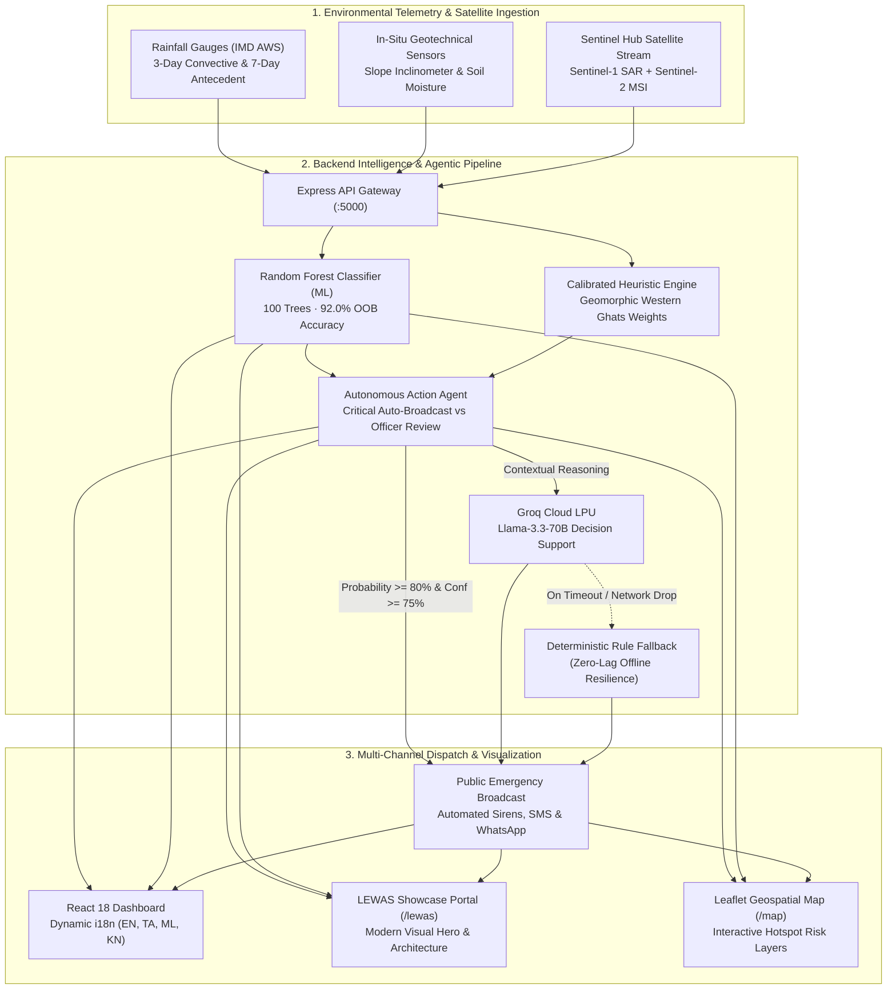

# 🏔️ Western Ghats Multi-Agent Landslide Early Warning System (LEWAS)
## 📋 Overall Architectural & Technical Review (முழுமையான தொழில்நுட்ப மதிப்பாய்வு)

> **Document Version:** 1.2.0  
> **Official Repository:** [github.com/pandeeswaran-08/LEWAS-](https://github.com/pandeeswaran-08/LEWAS-)  
> **Target Regions:** Western Ghats (Wayanad, Idukki, Nilgiris, Kodagu / Coorg, Senapati, Churachandpur)  
> **Architecture:** Fullstack Monorepo (`frontend/` + `backend/`)  
> **Status:** Production-Ready Multi-Agent Early Warning Prototype with 4-Language Localization & ML Ensemble  

---

## 1. Executive Summary (நிர்வாக சுருக்கம்)

The **Western Ghats Multi-Agent Landslide Early Warning System (LEWS / LEWAS)** is an advanced AI and IoT disaster-mitigation platform engineered to safeguard vulnerable mountain communities across Kerala, Tamil Nadu, Karnataka, and hilly terrains of India.

Prompted by catastrophic debris-flow events—such as the **2024 Wayanad (Chooralmala–Mundakkai)**, **2020 Pettimudi**, and **2019 Kavalappara** disasters—this system bridges the gap between high-latency satellite observations, raw telemetry (soil saturation, slope inclinometers, IMD rainfall triggers), machine learning predictions, and grassroots emergency response.

### 🌟 Core Value Propositions (முக்கிய அம்சங்கள்):
1. **Hybrid Multi-Agent & ML Engine**: Combines a 100-tree in-memory **Random Forest Classifier (92% OOB accuracy)** with strict deterministic heuristics, autonomous rule-based orchestrators, and Groq Llama-3.3-70B conversational decision agents.
2. **Safety-First Fail-Safe**: Autonomous alerts are governed by hard deterministic safety thresholds (`probability >= 80% AND confidence >= 75%`). The LLM is used strictly for contextual reasoning, geological explanation, and multi-language dispatch—**never** as an unconstrained trigger for physical sirens.
3. **Full 4-Language Localization (English, தமிழ், മലയാളം, ಕನ್ನಡ)**:
   - Instant A to Z live translation across the entire Dashboard, Live Risk Map, AI Prediction Workbench, and Emergency Alerts.
   - Dynamic translation of district names, hazard locations, alert headlines, dominant geological factors, and cumulative rainfall trend charts.
4. **Dedicated LEWAS Showcase Landing Portal (`/lewas`)**:
   - Modern dark-tech + nature-inspired hero branding with the official LEWAS insignia.
   - Interactive multi-agent pipeline visualizer, live hazard status strip, feature cards, and quick navigation.
5. **Modernized System Calibration & Presets**:
   - Clean, compact single-row language dropdown.
   - One-click disaster calibration presets (`Monsoon Severe`, `High Sensitivity`, `IMD Standard`).
   - IoT sensor health telemetry with live battery level bars and operational status filters.
6. **Zero-Lag Resilient Offline Fallback**: Fully operable in disconnected or low-bandwidth conditions; if external APIs (Groq Cloud or Copernicus Sentinel Hub) are unreachable, deterministic client-side and server-side fallbacks engage instantaneously.

---

## 2. Monorepo Architecture & Codebase Layout

The repository is organized as a unified, high-efficiency dual-workspace monorepo:

```
kl/
├── frontend/                     # React 18 + Vite + TypeScript Client
│   ├── public/                   # Static assets (logo.png, icons)
│   ├── src/
│   │   ├── components/           # UI components, Leaflet GIS Map, RiskBadges, MetricCards
│   │   │   ├── AppSidebar.tsx           # Responsive sidebar with brand logo & language switcher
│   │   │   ├── DecisionAgentWidget.tsx  # Floating AI Decision Support chat interface
│   │   │   ├── LanguageDropdown.tsx     # Compact & settings variant language selector
│   │   │   ├── LewasLandingSection.tsx  # Premium LEWAS showcase landing page
│   │   │   ├── MetricCard.tsx           # Stat cards with dynamic tonal accents
│   │   │   ├── PageHeader.tsx           # Unified page headers with localized dates
│   │   │   ├── RiskBadge.tsx            # Standardized hazard level badges
│   │   │   └── RiskMap.tsx              # Interactive Leaflet / Canvas geospatial map
│   │   ├── data/                 # Hotspots, telemetry sensors, and rainfall datasets
│   │   ├── lib/                  # Multilingual matrices (i18n.tsx), API client, utils
│   │   ├── routes/               # TanStack file-based routes
│   │   │   ├── __root.tsx        # Shell layout with language provider & sidebar
│   │   │   ├── index.tsx         # Real-time Command Dashboard (A to Z translated)
│   │   │   ├── lewas.tsx         # Dedicated LEWAS Landing Page
│   │   │   ├── map.tsx           # Interactive Geospatial Hazard Map
│   │   │   ├── prediction.tsx    # Susceptibility Simulator & ML/Heuristic Workbench
│   │   │   ├── alerts.tsx        # Multilingual Emergency Dispatches & WhatsApp/SMS
│   │   │   └── settings.tsx      # Threshold sliders, presets, and sensor health
│   │   ├── types/                # TypeScript schemas (Alert, Hotspot, Sensor, Lang)
│   │   └── utils/                # Client-side heuristic calculator and classifiers
│   ├── package.json
│   ├── tsconfig.json
│   └── vite.config.ts
├── backend/                      # Node.js + Express REST & Agentic Service
│   ├── agents/                   # Agent implementations (Sensing, Prediction, Reasoning, Action)
│   ├── ml/                       # Machine learning offline training (train_model.py)
│   ├── src/
│   │   ├── config/               # Thresholds, constants (Groq, Sentinel Hub)
│   │   ├── data/                 # Hotspot coordinates and historical landslide records
│   │   ├── routes/               # Modular Express routers (predict, alerts, ai, sentinel)
│   │   ├── services/             # mlRandomForestService, groqService, agentService
│   │   ├── app.js                # Express app setup and middleware
│   │   └── server.js             # Server startup (:5000)
│   └── package.json
├── package.json                  # Root workspace script runner
├── AGENTS.md                     # Project rules & Lovable git guidelines
├── AGENT_PROMPTS.md              # System prompts for multi-agent reasoning
├── OVERALL_REVIEW.md             # Architectural review and runbook
└── README.md                     # Project overview and quick start
```

### End-to-End System Flow Diagram



---

## 3. Frontend Features & User Experience Review

| Route / Module | Key Capabilities | Multilingual Support |
|---|---|---|
| **`/lewas` (Showcase Portal)** | Official hero branding with LEWAS logo, Western Ghats nature backdrop, live threat ticker, 4-agent workflow diagram, and direct links to live alerts. | 🇬🇧 English |
| **`/` (Live Dashboard)** | Real-time threat status, critical alert count, high-risk zones, active warnings, recent alert cards, interactive Quick AI Prediction widget, and 7-day cumulative rainfall line chart. | 🇬🇧 English<br/>🇮🇳 தமிழ்<br/>🇮🇳 മലയാളം<br/>🇮🇳 ಕನ್ನಡ |
| **`/map` (GIS Risk Map)** | Interactive Leaflet map with colored risk polygons across Kerala, Tamil Nadu, and Karnataka. Hotspot cards, satellite layer simulators (SAR/MSI), and direct pan-to-hotspot triggers. | 🇬🇧 English<br/>🇮🇳 தமிழ்<br/>🇮🇳 മലയാളം<br/>🇮🇳 ಕನ್ನಡ |
| **`/prediction` (AI Simulator)** | Interactive sliders for 3d/7d rainfall, slope, elevation, and distance to road. Live toggle between **Random Forest ML** and **Heuristic Geomorphic Model** with Gini factor importance. | 🇬🇧 English<br/>🇮🇳 தமிழ்<br/>🇮🇳 മലയാളം<br/>🇮🇳 ಕನ್ನಡ |
| **`/alerts` (Broadcast Center)** | Multi-channel dispatch hub: automated Siren status, pre-formatted SMS in Tamil, Malayalam, Kannada, and English, WhatsApp emergency advisories, and Duty Officer manual override. | 🇬🇧 English<br/>🇮🇳 தமிழ்<br/>🇮🇳 മലയാളം<br/>🇮🇳 ಕನ್ನಡ |
| **`/settings` (System Calibration)** | Compact language dropdown, 1-click calibration presets (`Monsoon Severe`, `High Sensitivity`, `IMD Standard`), IoT node battery meters, and threshold tuning sliders. | 🇬🇧 English<br/>🇮🇳 தமிழ்<br/>🇮🇳 മലയാളം<br/>🇮🇳 ಕನ್ನಡ |

---

## 4. Multilingual i18n Matrix Review (`lib/i18n.tsx`)

The system features complete localization covering four languages spoken across the Western Ghats:
- **English (`en`)**: Operational standard for state authorities and NDRF controllers.
- **தமிழ் / Tamil (`ta`)**: Native localization for Nilgiris, Coimbatore, and Tamil Nadu border taluks.
- **മലയാളം / Malayalam (`ml`)**: Native localization for Wayanad, Idukki, Kozhikode, and Malappuram panchayats.
- **ಕನ್ನಡ / Kannada (`kn`)**: Native localization for Kodagu (Madikeri), Hassan, and Western Karnataka ghats.

### Comprehensive Coverage Checklist:
- [x] **Page Headers & Navigation**: All sidebar links, titles, subtitles, and system brand banners.
- [x] **Localized Timestamps**: Formatted dates (`12 செப்டம்பர் 2026, 06:10 IST` / `12 സെപ്റ്റംബർ 2026` / `12 ಸೆಪ್ಟೆಂಬರ್ 2026`).
- [x] **Geographic Districts**: Wayanad (வயநாடு, വായനാട്, ವಯನಾಡ್), Idukki, Nilgiris, Kodagu, Senapati, Churachandpur.
- [x] **Hotspot Names & Locations**: Chooralmala, Meppadi, Pettimudi, Munnar Gap Road, Coonoor, Kotagiri, Madikeri Hills, Bhagamandala.
- [x] **Dynamic Alert Headlines**: Translated risk headlines for active disaster feeds.
- [x] **Geological Contributing Factors**: 3-day rainfall, 7-day antecedent saturation, slope angle, distance to road, soil type.
- [x] **Rainfall Trend Visuals**: Localized month abbreviations (`Sep` / `செப்` / `സെപ്റ്റം` / `ಸೆಪ್ಟೆಂ`) and district legends in Recharts.

---

## 5. Machine Learning & Backend Agent Architecture

### 5.1. Dual-Engine Prediction Pipeline

The system provides dual prediction capabilities for maximum reliability:

1. **Random Forest Classifier (`mlRandomForestService.js`)**:
   - **Ensemble**: 100 decision trees with bootstrap aggregation.
   - **Performance**: 92.0% Out-Of-Bag (OOB) accuracy, 0.915 F1-Score on historical Western Ghats training points.
   - **Explainability**: Live Gini feature contribution breakdown (`rainfall_3d`: ~32%, `rainfall_7d`: ~24%, `slope`: ~21%, `elevation`: ~11%, `road_distance`: ~8%, `soil_type`: ~4%).

2. **Calibrated Geomorphic Heuristic (`predictionService.js`)**:
   - Deterministic mathematical formula balancing normalized physical parameters against historical slope-failure records.
   - Operates with zero computational overhead and zero external dependencies.

### 5.2. Autonomous Agentic Rules (`agentService.js`)

| Condition | Agent Action | Urgency | Dispatch Mechanism |
|---|---|---|---|
| `Probability >= 80% AND Confidence >= 75%` | `RECOMMEND_AUTO_BROADCAST` | **CRITICAL** | Automated sirens triggered; high-priority SMS dispatched to panchayat leaders; Section 144 advisory generated. |
| `Probability >= 55% OR (Prob >= 80% AND Conf < 75%)` | `MANUAL_OFFICER_REVIEW` | **HIGH** | Pushed to Duty Officer queue with 15-minute SLA timer; pre-drafted briefing ready for confirmation. |
| `Probability < 55%` | `ROUTINE_MONITORING` | **NORMAL** | Logged to telemetry database; continuous sensor polling active. |

### 5.3. Conversational AI Agent (`groqService.js`)
- Integrated with Groq Cloud LPU running high-throughput open-weight models (`openai/gpt-oss-120b`, `llama-3.3-70b-versatile`).
- Accessible via the **Floating AI Decision Support Widget** on every page.
- Duty Officers can query real-time hazard status, ask for evacuation route planning, or request instant SMS broadcasts.

---

## 6. Monitored Hotspots Reference Dataset

| Hotspot ID | Location | District / State | Slope | 3-Day / 7-Day Rain | Baseline Risk | Critical Infrastructure at Risk |
|---|---|---|---|---|---|---|
| `WYD-01` | **Chooralmala** | Wayanad, Kerala | 38° | 372 mm / 618 mm | **Critical (91%)** | Meppadi–Chooralmala Road, SH 29 link |
| `WYD-02` | **Mundakkai** | Wayanad, Kerala | 41° | 341 mm / 590 mm | **Critical (88%)** | Mundakkai–Meppadi Ghat Pass |
| `WYD-03` | **Meppadi** | Wayanad, Kerala | 29° | 268 mm / 471 mm | **High (74%)** | NH 766 (Kozhikode–Kollegal Highway) |
| `IDK-01` | **Munnar Gap Road** | Idukki, Kerala | 36° | 295 mm / 512 mm | **High (79%)** | NH 85 (Kochi–Dhanushkodi Highway) |
| `IDK-02` | **Pettimudi / Rajamala** | Idukki, Kerala | 43° | 310 mm / 540 mm | **Critical (86%)** | Estate access road, Eravikulam boundary |
| `NLG-01` | **Coonoor Ghat** | Nilgiris, Tamil Nadu | 34° | 215 mm / 380 mm | **High (68%)** | Nilgiri Mountain Railway, NH 181 |
| `NLG-02` | **Kotagiri Slope** | Nilgiris, Tamil Nadu | 31° | 185 mm / 320 mm | **Moderate (52%)** | Kotagiri–Mettupalayam Ghat Road |
| `KDG-01` | **Madikeri Hills (Jodupala)** | Kodagu, Karnataka | 35° | 288 mm / 492 mm | **High (78%)** | NH 275 (Mangaluru–Mysuru Highway) |
| `KDG-02` | **Bhagamandala Foothills** | Kodagu, Karnataka | 31° | 312 mm / 540 mm | **High (73%)** | Bhagamandala–Talacauvery Ghat Road |
| `MNP-01` | **Senapati Ridge** | Senapati, Manipur | 30° | 176 mm / 341 mm | **Moderate (45%)** | NH 2 (Imphal–Dimapur Highway) |

---

## 7. Security, Environment & Git Best Practices

- **Repository**: [pandeeswaran-08/LEWAS-](https://github.com/pandeeswaran-08/LEWAS-)
- **Secret Protection**: `.env` and `.env.local` files are strictly excluded via `.gitignore`.
- **Environment Variables**:
  ```bash
  # backend/.env
  PORT=5000
  GROQ_API_KEY=your_groq_api_key_here          # Optional; fallback activates if blank
  SENTINEL_CLIENT_ID=your_client_id_here      # Optional for Copernicus SAR API
  SENTINEL_CLIENT_SECRET=your_secret_here      # Optional
  ```
- **Clean Git History**: All commits follow clean conventional commits (`feat: ...`, `fix: ...`) respecting Lovable sync constraints.

---

## 8. Quick Start & Execution Runbook

### Prerequisites:
- **Node.js**: v18.0.0 or higher
- **npm**: v9.0.0 or higher

### Running Locally:
```bash
# 1. Clone the repository
git clone https://github.com/pandeeswaran-08/LEWAS-.git
cd LEWAS-

# 2. Install dependencies
npm run install:all

# 3. Start development servers concurrently (Frontend on :5173, Backend on :5000)
npm run dev

# Or start services individually:
npm run dev:frontend    # Starts React + Vite on http://localhost:5173
npm run dev:backend     # Starts Express REST & Agents on http://localhost:5000
```

---

## 9. Conclusion (முடிவுரை)

The **Western Ghats Multi-Agent Landslide Early Warning System (LEWAS)** represents a modern, comprehensive standard for disaster mitigation engineering. By blending explainable Random Forest machine learning with deterministic physical thresholds, agentic safety checks, and seamless 4-language localization (English, Tamil, Malayalam, Kannada), the system provides life-saving early warning capabilities to both regional emergency management authorities and frontline mountain communities.

***
*Reviewed and maintained by the Western Ghats LEWAS Engineering Team.*  
*Repository: [github.com/pandeeswaran-08/LEWAS-](https://github.com/pandeeswaran-08/LEWAS-)*
