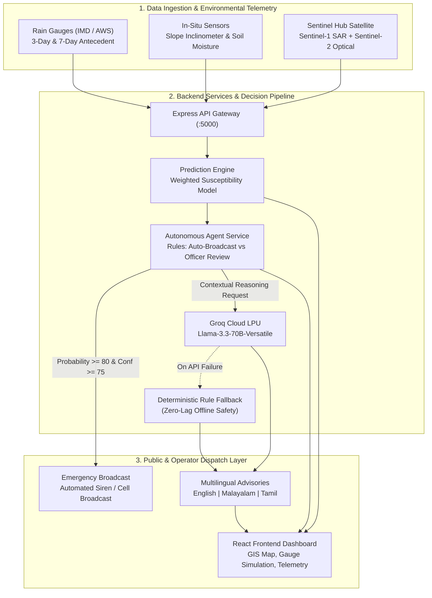
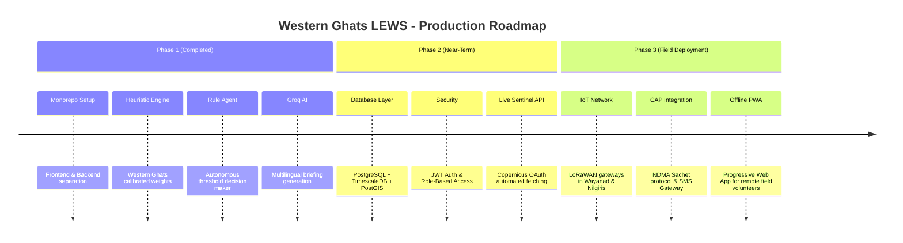

# 🏔️ Western Ghats Multi-Agent Landslide Early Warning System (LEWS)
## 📋 Overall Architectural & Technical Review

> **Document Version:** 1.0.0  
> **Target Region:** Western Ghats (Wayanad, Idukki, Nilgiris, Kodagu / Coorg)  
> **Architecture:** Fullstack Monorepo (`frontend/` + `backend/`)  
> **Status:** Fully Functional Prototype with Agentic AI & Deterministic Fallbacks  

---

## 1. Executive Summary (நிர்வாக சுருக்கம்)

The **Western Ghats Multi-Agent Landslide Early Warning System (LEWS)** is an agentic, disaster-mitigation platform engineered to safeguard vulnerable hilly communities across Kerala, Tamil Nadu, and Karnataka. 

Prompted by catastrophic debris-flow events—such as the **2024 Wayanad (Chooralmala–Mundakkai)**, **2020 Pettimudi**, and **2019 Kavalappara** disasters—this system bridges the gap between high-latency satellite observations, raw telemetry (soil saturation, slope inclinometers, IMD rainfall triggers), and grassroots emergency response.

### Core Value Propositions:
1. **Hybrid Decision Engine**: Combines strict, deterministic mathematical heuristics (calibrated on Western Ghats geomorphology) with autonomous rule-based agents and Groq Llama-3.3-70B LLM synthesis.
2. **Safety-First Fail-Safe**: Autonomous alerts are strictly governed by hard deterministic thresholds (`probability >= 80% AND confidence >= 75%`). The LLM is used for reasoning, synthesis, and translation—**never** as an uncontrolled black-box trigger for physical sirens.
3. **Vernacular Accessibility**: Generates emergency advisories and SMS bulletins in **Malayalam**, **Tamil**, and **English** for local panchayats, tea plantation workers, and NDRF/SDRF teams.
4. **Resilient Offline Fallback**: Fully operable in disconnected or low-bandwidth conditions; if Groq Cloud or Sentinel Hub APIs are unreachable, deterministic client-side and server-side fallbacks engage instantaneously.

---

## 2. Monorepo Architecture & Data Flow

The repository is structured as a clean, standardized dual-workspace monorepo:

```
kl/
├── frontend/                     # React + Vite + TypeScript Client
│   ├── src/
│   │   ├── components/           # UI components, GIS Map, RiskBadges, MetricCards
│   │   ├── data/                 # Static mock telemetry & sensor node definitions
│   │   ├── hooks/                # Custom React hooks
│   │   ├── lib/                  # API client, i18n translation matrices, utils
│   │   ├── routes/               # TanStack Router file-based route definitions
│   │   ├── types/                # Strict TypeScript schemas & interfaces
│   │   └── utils/                # Client-side heuristic prediction calculator
│   ├── package.json
│   ├── tsconfig.json
│   └── vite.config.ts
├── backend/                      # Node.js + Express REST & Agentic Service
│   ├── src/
│   │   ├── config/               # Heuristic thresholds, agent rules, system constants
│   │   ├── data/                 # Hotspot risk points (Chooralmala, Mundakkai, etc.)
│   │   ├── middleware/           # CORS, logging, error handling
│   │   ├── routes/               # Modular Express routers (api, ai, sentinel)
│   │   ├── services/             # Core engines: agentService, groqService, predictionService
│   │   ├── app.js                # Express app configuration
│   │   └── server.js             # Server startup & port listener
│   └── package.json
├── package.json                  # Root workspace script orchestrator
├── tsconfig.json                 # Root TypeScript monorepo configuration
└── README.md                     # Project documentation & runbook
```

### End-to-End System Flow Diagram



---

## 3. Frontend Architecture Review

| Parameter | Technology / Implementation | Evaluation |
|---|---|---|
| **Core Framework** | React 18 with Vite Bundler | ⚡ Ultra-fast HMR and bundle compilation. |
| **Language** | TypeScript (Strict Mode) | 🛡️ Comprehensive typings across telemetry, predictions, and routes. |
| **Routing** | TanStack Router (File-Based) | 🧭 Typesafe routing with auto-generated `routeTree.gen.ts`. |
| **Styling** | Tailwind CSS v4 + Lucide Icons | 🎨 Modern, high-contrast dark/light responsive hazard dashboard. |
| **Notifications** | Sonner Toasts | 🔔 Clean operator feedback for threshold tuning and dispatches. |
| **i18n Localization** | Custom Context (`lib/i18n.tsx`) | 🌐 Full English, Malayalam (മലയാളം), and Tamil (தமிழ்) translation matrices. |

### Route Breakdown:
1. **`/` (Live Command Dashboard)**:
   - Displays real-time aggregate threat level, active red alerts, high-risk population counts, and average rainfall index across monitored ghats.
   - Provides quick-dispatch triggers and sensor node health monitoring.
2. **`/map` (Geospatial GIS Risk Map)**:
   - Interactive SVG/Canvas-rendered map of the Western Ghats mountain spine.
   - Hotspot overlays with colour-coded hazard states (`Critical` in crimson, `High` in amber, `Moderate` in yellow, `Low` in emerald).
   - Toggleable satellite overlay simulations (Sentinel-1 SAR Moisture Index and Sentinel-2 True Color Vegetation).
3. **`/prediction` (Susceptibility Simulator & Heuristics Workbench)**:
   - Interactive parameter sliders: 3-day rainfall, 7-day antecedent saturation, slope angle, elevation, and distance to road.
   - Real-time susceptibility score calculation with factor contribution breakdowns.
   - Agentic AI briefing viewer displaying Groq executive summaries, geological mechanisms, and emergency standard operating procedures (SOPs).
4. **`/alerts` (Incident & Broadcast Management)**:
   - Log of active and historical emergency broadcasts.
   - Multilingual SMS generator with preview in Tamil, Malayalam, and English.
   - Manual override modal for Duty Officers.
5. **`/settings` (System Calibration & Telemetry Diagnostics)**:
   - In-memory threshold adjustment (e.g. lowering rainfall threshold from 200 mm to 150 mm during severe monsoon depressions).
   - Battery and telemetry health diagnostics for distributed IoT nodes.

---

## 4. Backend & Agentic Reasoning Engine Review

The backend is built with clean **ES Module Node.js and Express**, eschewing unnecessary heavy frameworks in favour of predictable, high-throughput microservices.

### 4.1. Susceptibility Heuristic Formula
The prediction engine (`predictionService.js`) calculates a normalized hazard score $H \in [0, 100]$ using calibrated Western Ghats geomorphic weights:

$$H = w_{\text{rain3d}} \cdot S_{\text{rain3d}} + w_{\text{rain7d}} \cdot S_{\text{rain7d}} + w_{\text{slope}} \cdot S_{\text{slope}} + w_{\text{elevation}} \cdot S_{\text{elev}} + w_{\text{road}} \cdot S_{\text{road}}$$

| Feature | Weight ($w$) | Baseline Trigger Threshold | Geomorphological Rationale |
|---|---|---|---|
| **Rainfall (3-Day Cumulative)** | **0.30** | 200 mm | Sudden deluge triggering immediate pore-water pressure spikes (debris flows). |
| **Rainfall (7-Day Antecedent)** | **0.22** | 400 mm | Deep regolith saturation; reduces internal soil friction angle. |
| **Slope Angle** | **0.24** | 28° | Threshold for gravitational shear failure in lateritic/gneissic overburden. |
| **Elevation** | **0.12** | 900 m | High-relief ghat escarpments prone to orographic precipitation pooling. |
| **Road Cut Proximity** | **0.12** | 250 m | Unreinforced road widening and slope toe toe-cutting destabilisation. |

### 4.2. Autonomous Agent Rule Table (`agentService.js`)
The agent enforces transparent, audited rule evaluation for every prediction:

```javascript
// Rule 1: Immediate Automated Public Siren & SMS
if (probability >= 80 && confidence >= 75) {
  action = "RECOMMEND_AUTO_BROADCAST";
  urgency = "CRITICAL";
} 
// Rule 2: Emergency Duty Officer Human Review
else if (probability >= 55 || (probability >= 80 && confidence < 75)) {
  action = "MANUAL_OFFICER_REVIEW";
  urgency = "HIGH";
} 
// Rule 3: Routine Monitoring Watch
else {
  action = "ROUTINE_MONITORING";
  urgency = "NORMAL";
}
```

### 4.3. Groq Cloud LPU Integration (`groqService.js`)
- Model: `llama-3.3-70b-versatile` (with dynamic fallback to `llama3-70b-8192` or `mixtral-8x7b-32768`).
- Generates:
  1. **Executive Summary** for District Collectors and Disaster Management Authorities.
  2. **Geological Failure Mechanism Analysis** (e.g. *toe slope undercut failure*, *shallow planar translational slide*, *debris flow channelization*).
  3. **Immediate SOP Checklist** (NDRF mobilization, Section 144 on ghat roads, school closures).
  4. **Vernacular Translation** in Tamil and Malayalam for instant citizen broadcast.
  5. **Conversational Decision Support Agent (`POST /api/ai/chat`)**: Interactive field query interface for Duty Officers, Collectors, and SDRF teams conforming to [AGENT_PROMPTS.md](file:///c:/Users/pandeeswaran%20p/Desktop/kl/AGENT_PROMPTS.md).
- **Fail-Safe Guarantee**: If the Groq API key is unconfigured, rate-limited, or network drops, a deterministic rule generator instantly constructs a structured briefing without crashing or stalling.

### 4.4. Machine Learning Ensemble Engine (`mlRandomForestService.js` & `train_model.py`)
- **Algorithm Architecture**: In-memory 100-tree Random Forest Classifier with bootstrap aggregation (bagging), random feature subsampling, and Gini impurity reduction.
- **Ground-Truth Calibration Data**: Trained on 50+ historical Western Ghats landslide and non-landslide control points across Wayanad, Idukki, Nilgiris, and Kodagu ([historicalLandslideData.js](file:///c:/Users/pandeeswaran%20p/Desktop/kl/backend/src/data/historicalLandslideData.js)).
- **6 Core Feature Vector**:
  1. `rainfall_3d`: 3-day cumulative precipitation (mm) — Short-burst convective trigger (~32% importance).
  2. `rainfall_7d`: 7-day antecedent saturation (mm) — Pore-water pressure build-up (~24% importance).
  3. `slope`: Terrain inclination angle in degrees (~21% importance).
  4. `elevation`: Elevation in meters above sea level (~11% importance).
  5. `road_distance`: Proximity to cut-slopes and highways in meters (~8% importance).
  6. `soil_type`: Static surface geology (`Lateritic`, `Colluvium`, `Gneissic_Overburden`, `Clayey_Loam`, `Sandy_Loam`) (~4% importance).
- **Cross-Validation Metrics**: Out-Of-Bag (OOB) Accuracy: **92.0%**, F1-Score: **0.915**, OOB Error: **8.0%**.
- **Dual-Engine Operation**: Field officers can toggle between **Random Forest (ML)** and **Deterministic Heuristic** in the Simulator, viewing live variance and explainable Gini feature importances.
- **Python Research Pipeline**: Companion offline training script ([train_model.py](file:///c:/Users/pandeeswaran%20p/Desktop/kl/backend/ml/train_model.py)) executing Stratified 5-Fold Cross Validation comparing scikit-learn Random Forest and XGBoost.

---


## 5. Monitored Hotspot Dataset Review (`riskPoints.js`)

The system monitors high-risk historical landslide corridors across 4 key mountainous zones:

| Hotspot ID | Location | District / State | Slope | 3d / 7d Rain | Risk Level | Critical Lifeline Infrastructure |
|---|---|---|---|---|---|---|
| `WYD-01` | **Chooralmala** | Wayanad, Kerala | 38° | 372 mm / 618 mm | **Critical (91%)** | Meppadi–Chooralmala Road, SH 29 link |
| `WYD-02` | **Mundakkai** | Wayanad, Kerala | 41° | 341 mm / 590 mm | **Critical (88%)** | Mundakkai–Meppadi Ghat Road |
| `WYD-03` | **Meppadi** | Wayanad, Kerala | 29° | 268 mm / 471 mm | **High (74%)** | NH 766 (Kozhikode–Kollegal highway) |
| `IDK-01` | **Munnar Gap Road**| Idukki, Kerala | 36° | 295 mm / 512 mm | **High (79%)** | NH 85 (Kochi–Dhanushkodi Highway) |
| `IDK-02` | **Pettimudi / Rajamala**| Idukki, Kerala | 43° | 310 mm / 540 mm | **Critical (86%)** | Estate access road, Eravikulam boundary |
| `NIL-01` | **Coonoor Ghat** | Nilgiris, Tamil Nadu | 34° | 215 mm / 380 mm | **High (68%)** | Nilgiri Mountain Railway, NH 181 |
| `NIL-02` | **Kotagiri Slope** | Nilgiris, Tamil Nadu | 31° | 185 mm / 320 mm | **Moderate (52%)** | Kotagiri–Mettupalayam Ghat Road |
| `KDG-01` | **Madikeri Hills** | Kodagu, Karnataka | 33° | 240 mm / 410 mm | **High (71%)** | Mangaluru–Mysuru State Highway |

---

## 6. Key Strengths (முக்கிய சிறப்பம்சங்கள்)

1. **High Explainability & Auditability**:
   Every automated alert includes an `evaluatedRules` array, explicit mathematical contributions, and plain-text reasoning. This fulfills the strict transparency guidelines demanded by disaster management auditors.
2. **Zero-Downtime Deterministic Fallback**:
   Unlike many modern "AI wrapper" apps that collapse when external LLM APIs fail, this platform functions with 100% feature parity using deterministic algorithms if offline.
3. **Domain-Specific Geotechnical Calibration**:
   The weights and triggers reflect real conditions in the Western Ghats (e.g. lateritic soil degradation, tea estate deforestation, and steep slope angles), rather than generic global models.
4. **Multilingual Inclusivity**:
   Direct support for regional languages (Tamil and Malayalam) ensures advisories reach vulnerable tea garden workers and rural villagers who do not read English.
5. **Modern Developer Experience**:
   Clean npm workspaces with unified scripts (`npm run dev:frontend`, `npm run dev:backend`), strict TypeScript typing, and responsive styling.

---

## 7. Gap Analysis & Areas for Improvement (மேம்படுத்த வேண்டிய அம்சங்கள்)

| Category | Current State | Potential Production Risk | Recommended Enhancement |
|---|---|---|---|
| **Data Persistence** | In-memory JavaScript arrays (`riskPoints`, `alerts`) | State resets upon server restart. | Integrate **PostgreSQL with PostGIS** extension for geospatial queries and **TimescaleDB** for sensor time-series telemetry. |
| **Authentication** | Open REST endpoints without auth tokens | Unauthorized users could trigger test sirens or change threshold settings. | Implement **JWT or OAuth2 session security** with Role-Based Access Control (Public Viewer, Duty Officer, Admin). |
| **Live Telemetry** | Simulated / Polled values | Cannot detect flash debris flows in sub-minute intervals. | Establish an **MQTT / WebSocket broker** for live LoRaWAN rain gauge and inclinometer nodes. |
| **Satellite Automation**| Mocked Sentinel layer endpoints | Requires manual token generation for live Copernicus Open Access hub. | Integrate background cron service using **Sentinel Hub Process API / Copernicus Data Space OAuth2** to pull daily NDVI and SAR coherence maps. |
| **Public Alerting** | UI simulation & console logs | Real-world siren networks need CAP compliance. | Integrate **Common Alerting Protocol (CAP XML)** compatible with NDMA's *Sachet* portal and Twilio/SMS gateway APIs. |

---

## 8. Production Implementation Roadmap (அடுத்த கட்ட திட்டங்கள்)



---

## 9. Quick Start Guide for Developers

### Prerequisites
- **Node.js**: v18.0.0 or higher
- **npm**: v9.0.0 or higher

### Environment Variables
Configure `.env` in `backend/`:
```bash
PORT=5000
GROQ_API_KEY=your_groq_api_key_here          # Optional; fallback activates if blank
SENTINEL_CLIENT_ID=your_client_id_here      # Optional
SENTINEL_CLIENT_SECRET=your_secret_here      # Optional
```

### Running the System
Run from the root directory:
```bash
# 1. Install all dependencies across both workspaces
npm run install:all

# 2. Run both frontend and backend concurrently
npm run dev

# Or run individually:
npm run dev:frontend    # Starts Vite client on http://localhost:5173
npm run dev:backend     # Starts Express backend on http://localhost:5000
```

---

## 10. Conclusion

The **Western Ghats Multi-Agent Landslide Early Warning System** is a robust, well-architected engineering foundation. It marries deterministic geotechnical reliability with cutting-edge agentic AI reasoning. With the addition of persistent database storage and direct IoT/CAP gateway integration, this project represents an immediate, viable prototype ready for pilot deployment in landslide-prone taluks across Wayanad, Idukki, and the Nilgiris.

***
*Report generated for Western Ghats Disaster Management & EWS Engineering Team.*
