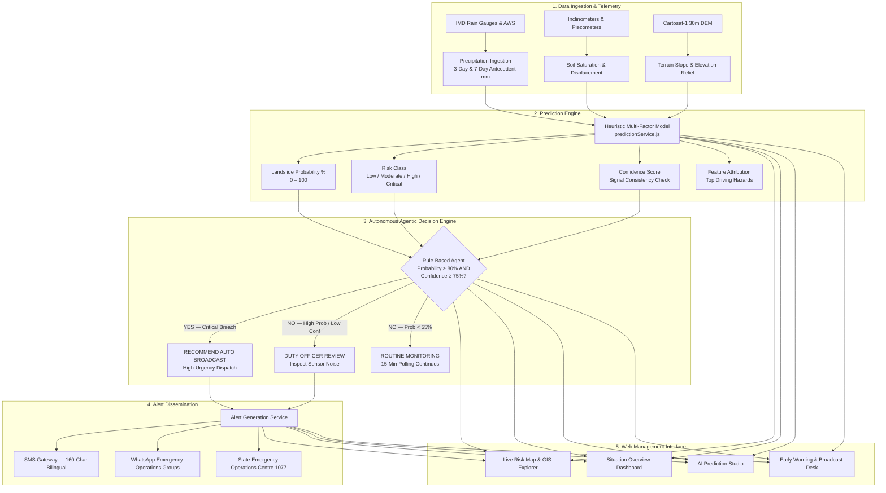

# 🏔️ Western Ghats Landslide Early Warning System (EWS)

> A hyperlocal, AI-augmented platform for landslide susceptibility monitoring, real-time prediction, and multi-channel emergency alert broadcast — built specifically for high-relief hill districts across the Western Ghats.

---

## 📑 Table of Contents

1. [System Overview](#-system-overview)
2. [Tech Stack](#-tech-stack)
3. [Satellite & Earth Observation Architecture](#️-satellite--earth-observation-eo-architecture)
4. [End-to-End System Architecture](#-end-to-end-system-architecture)
5. [AI Prediction Model & Agentic Decision Engine](#-ai-prediction-model--agentic-decision-engine)
6. [Multilingual Support](#-multilingual-support)
7. [Directory Structure](#-directory-structure)
8. [REST API Reference](#-rest-api-reference)
9. [Getting Started](#-getting-started)
10. [Operational Scenarios & Emergency Protocol](#-operational-scenarios--emergency-protocol)

---

## 🌐 System Overview

The **Western Ghats Landslide Early Warning System** is a full-stack disaster risk reduction platform built for vulnerable ghat terrains — Wayanad, Idukki, the Nilgiris, and similar hill districts where landslide events have repeatedly caused catastrophic loss of life.

The system brings together four core capabilities under one platform:

**Hydrometeorological Monitoring** tracks 3-day and 7-day antecedent rainfall in real time, feeding a soil saturation index that reflects ground conditions before a slide, not just during active rainfall.

**Topographic Terrain Modeling** ingests slope angle, elevation relief, and proximity to cut-slope roads — the three terrain factors that consistently appear in post-event forensic analysis of Western Ghats debris flows.

**Explainable AI Prediction** runs a multi-factor heuristic model that produces a landslide failure probability alongside feature attribution scores, so emergency officers understand *why* an alert was triggered — not just that it was.

**Autonomous Alert Broadcast** eliminates the dangerous delay between a critical prediction and public notification. When probability and confidence thresholds are both breached, the system recommends an automated evacuation broadcast without waiting for manual approval. This design is a direct lesson from the Wayanad and Pettimudi events, where notification delays cost lives.

---

## 🛠️ Tech Stack

| Technology | Layer | Role |
|---|---|---|
| **React 19** | Frontend | Declarative component UI with the latest React 19 performance improvements |
| **TanStack Start / Router** | Routing & SSR | Type-safe, file-based routing with nested layouts and full SSR support |
| **TanStack Query v5** | Server State | Async data caching, deduplication, and background synchronization |
| **Tailwind CSS v4 + Radix UI** | Styling & Primitives | Utility-first styling layered over accessible dialog, dropdown, and tooltip primitives |
| **OKLCH Color Palette** | Design System | Perceptual color space for consistent contrast across light and dark modes |
| **Leaflet + React-Leaflet** | Geospatial Maps | Interactive terrain and satellite maps with color-coded risk markers and boundary overlays |
| **Recharts** | Data Visualization | SVG-based interactive charts for 7-day rainfall trends and feature contribution breakdowns |
| **Lucide React** | Icons | Lightweight, accessible vector icons for hazard indicators and navigation |
| **Sonner** | Toast Notifications | Stackable feedback toasts for configuration changes and alert actions |
| **TypeScript v5.8** | Language | End-to-end static typing across routes, models, API contracts, and prediction inputs |
| **Express.js** | Backend Framework | REST API endpoints for risk points, predictions, alert generation, and agent telemetry |
| **Bun / Node.js** | Runtime | High-speed JavaScript runtime powering the server and package execution |
| **Vite 8** | Build Tooling | Fast HMR and optimized ESM bundling for development and production |
| **Sentinel Hub API** | Earth Observation | Live Sentinel-1 SAR interferometry and Sentinel-2 multispectral change detection |
| **CORS** | Security Middleware | Cross-origin resource sharing configured for secure frontend-backend communication |

---

## 🛰️ Satellite & Earth Observation (EO) Architecture

The mapping engine is built around three stacked layers, each serving a distinct purpose in disaster risk visualization:

| Layer | Provider | Purpose |
|---|---|---|
| **Base Map** | OpenStreetMap + OpenTopoMap | Geographic reference and high-contrast topographic elevation with contour lines for slope evaluation |
| **Satellite Imagery** | Esri World Imagery | Sub-meter optical imagery for inspecting ghat roads, tea estates, buildings, and valley terrain |
| **Sentinel Overlay** | EO Browser + Google Earth Engine | Pre-processed radar and optical change detection highlighting ground displacement and landslide scar progression (e.g., Chooralmala–Mundakkai, Munnar Gap Road) |

> ### Why Sentinel-1 and Sentinel-2 Matter Here
>
> **Sentinel-1 (C-Band SAR)** is cloud-penetrating synthetic aperture radar. During active monsoon conditions — when optical satellites are useless — Sentinel-1 continues capturing interferometric coherence loss and sub-centimeter slope deformation through the storm cloud cover. For Western Ghats monitoring, this is essential.
>
> **Sentinel-2 (Multispectral, 10m)** calculates normalized difference vegetation index drops (dNDVI) and soil reflectance signatures to delineate exact slide footprints after an event, enabling rapid damage assessment.
>
> The system is equipped with Sentinel Hub API integration for automated orbit-pass ingestion over Western Ghats hill districts.

---

## 🔄 End-to-End System Architecture

The diagram below shows the full data flow, from hillside sensor telemetry through prediction and autonomous decision-making, all the way to emergency broadcast and the web management interface.



---

## 🧠 AI Prediction Model & Agentic Decision Engine

### Multi-Factor Susceptibility Model

The heuristic risk engine normalizes sensor inputs against geological thresholds calibrated against historic Western Ghats debris flows — specifically the Chooralmala 2024 and Pettimudi 2020 events, which serve as the primary empirical baseline for this region.

$$\text{Hazard Score} = \sum (\text{Normalized Feature}_i \times \text{Weight}_i) \times \text{District Factor} + \text{Compound Penalty}$$

**Feature weights and thresholds:**

| Feature | Weight | Critical Threshold |
|---|---|---|
| 3-Day Cumulative Rainfall | 30% | > 200 mm |
| 7-Day Antecedent Rainfall | 22% | > 400 mm |
| Terrain Slope Angle | 24% | > 28° |
| Elevation Relief | 12% | > 900 m |
| Cut-Slope Road Proximity | 12% | < 250 m |

**Compound saturation penalty:** An additional +8% is added to the hazard score when heavy short-burst rainfall hits already-saturated ground — specifically when 3-day rainfall exceeds 200 mm while 7-day antecedent rainfall exceeds 400 mm. This captures the saturation state that routinely precedes debris flows in the Ghats.

---

### Autonomous Rule-Based Agent (`agentService.js`)

The agent operates continuously alongside the prediction engine, applying a strict three-rule safety protocol to every prediction result:

```javascript
// Rule 1: Imminent danger — autonomous broadcast
if (probability >= 80 && confidence >= 75) {
  recommendAutoAlert = true;
  action = "RECOMMEND_AUTO_BROADCAST";
  urgency = "CRITICAL";
  reasoning = "Critical threshold breached. Immediate automated evacuation notice dispatched.";
}

// Rule 2: High probability but low sensor confidence — human validation required
else if (probability >= 80 && confidence < 75) {
  recommendAutoAlert = false;
  action = "MANUAL_OFFICER_REVIEW";
  reasoning = "High probability but lower sensor confidence. Requires human validation to avoid false alarms.";
}

// Rule 3: Conditions within tolerance — continue standard monitoring
else {
  recommendAutoAlert = false;
  action = "ROUTINE_MONITORING";
  reasoning = "Conditions within watch tolerance. Continue standard 15-minute polling.";
}
```

Rule 2 is particularly important: the system doesn't blindly auto-broadcast when sensor readings are inconsistent. A high probability driven by noisy or potentially faulty sensor data routes through a human officer for verification. This prevents false evacuations, which erode public trust and reduce compliance with future alerts.

---

## 🌍 Multilingual Support

The platform is fully localized in four languages critical for Western Ghats emergency operations:

- **English (`en`)** — Default administrative and operational language
- **தமிழ் (`ta`)** — For Nilgiris, Coimbatore, and Tamil Nadu border districts
- **മലയാളം (`ml`)** — For Wayanad, Idukki, Kozhikode, and Kerala state response units
- **ಕನ್ನಡ (`kn`)** — For Kodagu, Chikkamagaluru, Hassan, and Karnataka ghat districts

The localization engine is managed through a global `<LanguageProvider>` with a reactive `useI18n()` hook. Language preference persists via `localStorage` (`ews-lang`) and applies consistently across all five routes: Dashboard, Live Risk Map, Prediction Studio, Alert Broadcast Desk, and System Settings — including all dynamic risk badges and alert messages.

---

## 📂 Directory Structure

```
kl/
├── frontend/                            # React 19 + TanStack Start application
│   ├── package.json
│   ├── tsconfig.json                    # TypeScript path aliases and compiler config
│   ├── vite.config.ts                   # Vite bundler and SSR configuration
│   ├── components.json                  # Shadcn UI registry
│   ├── .env                             # VITE_API_URL=http://localhost:5000/api
│   └── src/
│       ├── components/
│       │   ├── AppSidebar.tsx           # Navigation sidebar with language selector
│       │   ├── MetricCard.tsx           # KPI counter with contextual tone indicators
│       │   ├── PageHeader.tsx           # Page titles with eyebrow labels and action slots
│       │   ├── RiskBadge.tsx            # Multilingual, dynamic risk status badge
│       │   └── RiskMap.tsx              # Leaflet interactive terrain and Sentinel EO map
│       ├── data/mockData.ts             # Hotspots, alert records, and 7-day rainfall trend data
│       ├── lib/
│       │   ├── api.ts                   # REST API client with backend fallback handling
│       │   ├── i18n.tsx                 # Translation dictionaries — EN, TA, ML
│       │   └── utils.ts                 # Tailwind class merging (cn utility)
│       ├── routes/
│       │   ├── __root.tsx               # App shell — sidebar, mobile header, toast provider
│       │   ├── index.tsx                # / — Landslide Risk Dashboard
│       │   ├── map.tsx                  # /map — Live Risk Map & Sentinel Explorer
│       │   ├── prediction.tsx           # /prediction — Explainable AI Prediction Studio
│       │   ├── alerts.tsx               # /alerts — Early Warning & Broadcast Desk
│       │   └── settings.tsx             # /settings — Telemetry Health & Threshold Config
│       ├── styles.css                   # Design tokens, OKLCH colors, Tailwind v4 directives
│       └── types/index.ts               # Core TypeScript interfaces — Hotspot, Alert, etc.
│
├── backend/                             # Express.js API service
│   ├── package.json
│   ├── .env                             # GROQ_API_KEY, Sentinel Hub credentials
│   ├── README.md                        # Backend-specific docs and curl examples
│   └── src/
│       ├── app.js                       # Express setup, CORS, request logger
│       ├── server.js                    # HTTP listener on port 5000
│       ├── config/constants.js          # Hazard thresholds, model weights, agent rules, API configs
│       ├── data/
│       │   ├── alerts.js                # In-memory alert dataset with emergency contacts
│       │   └── riskPoints.js            # Monitored hotspot coordinates, elevation, and slope data
│       ├── middleware/errorHandler.js   # 404 handler and central error middleware
│       ├── routes/
│       │   ├── agent.js                 # GET  /api/agent/status
│       │   ├── ai.js                    # GET  /api/ai/status  |  POST /briefing, /sms (Groq LLaMA 3.3)
│       │   ├── alerts.js                # GET  /api/alerts  |  POST /generate, /send
│       │   ├── health.js                # GET  /api/health
│       │   ├── predict.js               # POST /api/predict (model + agent + Groq briefing)
│       │   ├── riskPoints.js            # GET  /api/risk-points
│       │   └── sentinel.js              # GET  /api/sentinel/status, /layers  |  POST /token
│       └── services/
│           ├── agentService.js          # Autonomous rule-based agentic decision engine
│           ├── groqService.js           # Groq Cloud LPU — LLaMA 3.3 70B inference with fallback
│           ├── predictionService.js     # Multi-factor susceptibility calculation
│           └── sentinelService.js       # Sentinel Hub OAuth token management
│
├── package.json                         # Root monorepo workspace coordinator
├── README.md                            # This file
└── AGENTS.md                            # Multi-agent specifications and safety constraints
```

---

## 📡 REST API Reference

| Method | Endpoint | Description | Example Payload / Query |
|---|---|---|---|
| `GET` | `/api/health` | Service health status and server timestamp | — |
| `GET` | `/api/risk-points` | All monitored risk hotspots | `?district=Wayanad&risk=Critical` |
| `GET` | `/api/alerts` | Recent alerts and emergency contact lines | `?severity=Critical` |
| `POST` | `/api/predict` | Runs model + agent decision + Groq AI briefing | `{"district":"Wayanad","rainfall3d":350,"rainfall7d":590}` |
| `POST` | `/api/alerts/generate` | Generates a 160-char SMS in English, Malayalam, and Tamil | `{"location":"Chooralmala","severity":"Critical","probability":90}` |
| `POST` | `/api/alerts/send` | Simulates SMS transmission to gateway | `{"alertId":"WYD-01","message":"Evacuate Chooralmala"}` |
| `GET` | `/api/agent/status` | Current agent operational status and active rules | — |
| `GET` | `/api/ai/status` | Groq Cloud LPU engine status and active model | — |
| `POST` | `/api/ai/briefing` | On-demand geotechnical situation briefing via LLaMA 3.3 | `{"district":"Wayanad","probability":85}` |
| `POST` | `/api/ai/sms` | Trilingual crisis SMS generation via Groq | `{"location":"Mundakkai","severity":"Critical"}` |
| `GET` | `/api/sentinel/status` | Sentinel Hub connection status | — |
| `GET` | `/api/sentinel/layers` | Sentinel-1/2 SAR and optical layer catalog | — |
| `POST` | `/api/sentinel/token` | Verifies live token against Sentinel Hub OAuth | — |

### Example: Running a Prediction

```bash
curl -X POST http://localhost:5000/api/predict \
  -H "Content-Type: application/json" \
  -d '{
    "district": "Wayanad",
    "rainfall3d": 320,
    "rainfall7d": 580,
    "slope": 38
  }'
```

**Response:**

```json
{
  "success": true,
  "district": "Wayanad",
  "probability": 89,
  "riskClass": "Critical",
  "confidence": 88,
  "topFactors": [
    {
      "factor": "3-Day Cumulative Rainfall",
      "value": "320 mm",
      "threshold": "> 200 mm",
      "contribution": 36,
      "exceeded": true
    }
  ],
  "agentDecision": {
    "recommendAutoAlert": true,
    "action": "RECOMMEND_AUTO_BROADCAST",
    "urgency": "CRITICAL",
    "reasoning": "CRITICAL AUTOMATION TRIGGER: Landslide probability (89%) ≥ 80% and confidence (88%) ≥ 75%. Autonomous early warning dispatch is strongly recommended.",
    "timestamp": "2026-09-12T10:00:00.000Z"
  }
}
```

---

## 🚀 Getting Started

### Prerequisites

- Node.js v18+ or Bun v1.2+
- A modern browser (Chrome, Edge, Firefox, Safari)

---

### Option A: Monorepo Root (Recommended)

Run everything from the root `kl/` directory:

```bash
# Install all dependencies across frontend and backend
npm run install:all

# Terminal 1 — Start the Express backend
npm run dev:backend

# Terminal 2 — Start the frontend dashboard
npm run dev:frontend
```

Open `http://localhost:5173` in your browser.

---

### Option B: Services Individually

**Frontend:**
```bash
cd frontend
npm install
npm run dev
# Runs at http://localhost:5173
```

**Backend:**
```bash
cd backend
npm install
npm start
# Runs at http://localhost:5000
```

---

## 🚨 Operational Scenarios & Emergency Protocol

| Hazard Level | Probability Range | Agent Behavior | Required Human Action |
|---|---|---|---|
| **Low** | 0% – 29% | Standard 15-minute sensor polling | Regular telemetry logging |
| **Moderate** | 30% – 54% | Yellow advisory issued | Highway patrols monitor drainage channels on ghat passes |
| **High** | 55% – 74% | Orange alert; duty officer notified | Night travel restrictions on ghat roads; response machinery placed on standby |
| **Critical** | 75% – 100% | **Auto-broadcast recommended** when confidence ≥ 75% | Evacuate downstream settlements to designated relief camps; dispatch bilingual SMS to residents |

When confidence falls below 75% despite a Critical probability reading, the agent routes the decision to a duty officer rather than auto-broadcasting. The system is designed to be aggressive about alerting and cautious about false alarms — both failures have serious consequences in disaster response.

---

*Western Ghats Landslide Early Warning System — Built for Disaster Risk Reduction and Climate Resilience.*
