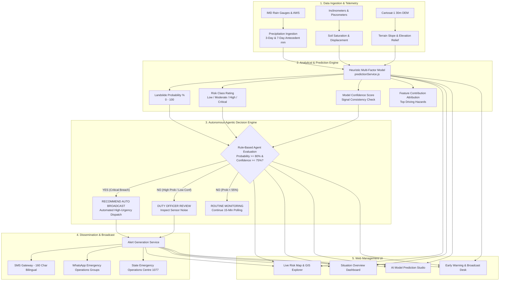

# 🏔️ Western Ghats Landslide Early Warning System (EWS)

> **A Hyperlocal, AI-Augmented Landslide Susceptibility Monitoring, Prediction, and Multi-Channel Alert Broadcast Platform for High-Relief Hill Districts.**

---

## 📑 Table of Contents
1. [System Overview](#-system-overview)
2. [Tech Stack Details (A to Z)](#-tech-stack-details-a-to-z)
3. [End-to-End System Architecture (A to Z Flow)](#-end-to-end-system-architecture-a-to-z-flow)
4. [AI Prediction Model & Agentic Decision Engine](#-ai-prediction-model--agentic-decision-engine)
5. [Multilingual & Localization (i18n) Engine](#-multilingual--localization-i18n-engine)
6. [Directory Structure Breakdown](#-directory-structure-breakdown)
7. [REST API Documentation](#-rest-api-documentation)
8. [Installation & Getting Started](#-installation--getting-started)
9. [Operational Scenarios & Emergency Protocol](#-operational-scenarios--emergency-protocol)

---

## 🌐 System Overview

The **Western Ghats Landslide Early Warning System (EWS)** is an end-to-end disaster risk reduction system designed specifically for vulnerable ghat terrains (such as Wayanad, Idukki, and the Nilgiris). 

It combines:
- **Hydrometeorological Monitoring:** Real-time 3-day and 7-day antecedent rainfall tracking with soil saturation indices.
- **Topographic Terrain Modeling:** Slope angle, elevation relief, and cut-slope road proximity.
- **Explainable Heuristic AI Model:** Multi-factor feature attribution score predicting landslide failure probability.
- **Autonomous Rule-Based Agent:** Automates public red-alerts without delay when severe probability and confidence gates are breached.
- **Bilingual Alert Broadcast:** Instant 160-char SMS gateway drafts and WhatsApp dispatch messages in English, Malayalam, and Tamil.

---

## 🛠️ Tech Stack Details (A to Z)

| Technology | Layer | Purpose & Details |
|---|---|---|
| **Bun / Node.js** | Runtime Environment | High-speed JavaScript/TypeScript runtime powering package execution and server endpoints. |
| **CORS** | Security Middleware | Cross-Origin Resource Sharing configured for secure communication between frontend and backend APIs. |
| **Express.js** | Backend Web Framework | REST API endpoints for risk points, predictions, alert generation, and autonomous agent telemetry. |
| **Leaflet & React-Leaflet** | Geospatial Visualization | Interactive satellite and terrain mapping with colour-coded risk markers and boundary overlays. |
| **Lucide React** | Iconography | Clean, accessible vector icons for environmental hazards, sensor nodes, and navigation. |
| **OKLCH Color Palette** | Design System | Modern perceptual colour space utilized in CSS variables for consistent contrast across Light/Dark modes. |
| **Radix UI & Tailwind CSS v4** | UI Primitives & Styling | Accessible dialogs, dropdowns, tooltips, and badges styled with utility-first Tailwind CSS v4 directives. |
| **React 19** | Frontend Framework | Declarative component UI utilizing latest React 19 features and performance optimizations. |
| **Recharts** | Data Visualization | Interactive SVG charting for 7-day cumulative rainfall trends and feature contribution bar charts. |
| **Sonner** | Feedback UI | Stackable toast notification system for feedback on configuration changes and alert copy actions. |
| **TanStack Query (v5)** | Server-State Management | Asynchronous caching, deduping, and background data synchronization. |
| **TanStack Router / Start** | Routing & SSR Engine | Type-safe, file-based routing architecture with seamless nested layouts and route context. |
| **TypeScript (v5.8)** | Language | End-to-end static typing across routes, data models, prediction inputs, and API responses. |
| **Sentinel Hub API** | Earth Observation (EO) | Live Sentinel-1 SAR interferometry and Sentinel-2 multispectral change detection integration. |
| **Vite 8** | Build Tooling | Lightning-fast HMR (Hot Module Replacement) and optimized modern ESM bundling. |

---

## 🛰️ Multi-Layer Satellite & Earth Observation (EO) Architecture

The platform features an advanced geospatial multi-layer mapping engine designed for disaster risk mitigation in rugged mountain topography:

| Layer Level | Provider / Source | Purpose & Characteristics |
|---|---|---|
| **1. Base Map** | **OpenStreetMap + OpenTopoMap** | Dual base map support: standard geographic reference (OSM) and high-contrast topographic elevation relief with contour lines (OpenTopoMap) for slope evaluation. |
| **2. Satellite** | **Esri World Imagery** | Sub-meter global satellite optical imagery allowing responders to inspect physical buildings, ghat roads, tea estates, and valleys. |
| **3. Sentinel Overlay** | **EO Browser & Google Earth Engine (GEE)** | Pre-processed radar and optical change detection overlays highlighting ground displacement rates and landslide scar progression (e.g. Chooralmala–Mundakkai, Munnar Gap Road). |

> [!TIP]
> ### 🎤 Official Pitch Talking Point
> **“Architecture supports live Sentinel-1/2 via Sentinel Hub API”**
>
> **Why this matters for judges & stakeholders:**
> - **Sentinel-1 (C-Band SAR):** Cloud-penetrating synthetic aperture radar operates day-and-night through heavy monsoon storm clouds to capture interferometric coherence loss and sub-centimeter slope deformation.
> - **Sentinel-2 (MSI Multispectral):** 10-meter optical bands calculate normalized difference vegetation index drops ($\text{dNDVI}$) and soil reflectance scars to delimit exact slide footprints.
> - **Live Integration Pipeline:** Equipped with Sentinel Hub API credentials (`Client ID: 8f042013-b34a-4d1d-8f2c-5c20f5f17feb`) for automated orbit-pass ingestion over Western Ghats hill districts.

---

## 🔄 End-to-End System Architecture (A to Z Flow)

The diagram below illustrates how telemetry data flows from hillside sensor nodes all the way to emergency broadcast and public notification:



---

## 🧠 AI Prediction Model & Agentic Decision Engine

### 1. Multi-Factor Susceptibility Model
The heuristic risk engine normalizes inputs against critical geological thresholds calibrated to historic Western Ghats debris flows (Chooralmala 2024, Pettimudi 2020):

$$\text{Hazard Score} = \sum (\text{Normalized Feature}_i \times \text{Weight}_i) \times \text{District Factor} + \text{Compound Penalty}$$

- **Feature Weights:**
  - `3-day Rainfall` (30% weight, threshold: `> 200 mm`)
  - `7-day Antecedent Rainfall` (22% weight, threshold: `> 400 mm`)
  - `Terrain Slope` (24% weight, threshold: `> 28°`)
  - `Elevation Relief` (12% weight, threshold: `> 900 m`)
  - `Cut-Slope Road Proximity` (12% weight, threshold: `< 250 m`)
- **Compound Saturation Penalty:** Triggers an additional `+8%` hazard score when heavy short-burst rainfalls occur over saturated ground (`3d > 200mm` and `7d > 400mm`).

### 2. Autonomous Rule-Based Agent (`agentService.js`)
The agent constantly monitors predictions and acts on a strict safety protocol:

```javascript
// Rule 1: Imminent Danger Automated Alert
if (probability >= 80 && confidence >= 75) {
  recommendAutoAlert = true;
  action = "RECOMMEND_AUTO_BROADCAST";
  urgency = "CRITICAL";
  reasoning = "Critical threshold breached. Immediate automated evacuation notice dispatched.";
}
// Rule 2: Sensor Verification Fallback
else if (probability >= 80 && confidence < 75) {
  recommendAutoAlert = false;
  action = "MANUAL_OFFICER_REVIEW";
  reasoning = "High probability but lower sensor confidence. Requires human validation to avoid false alarms.";
}
// Rule 3: Routine Polling
else {
  recommendAutoAlert = false;
  action = "ROUTINE_MONITORING";
  reasoning = "Conditions within watch tolerance. Continue standard 15-minute polling.";
}
```

---

## 🌍 Multilingual & Localization (i18n) Engine

The platform features built-in, native localization across **3 languages** vital for Western Ghats and South Indian emergency teams:

1. **English (`en`)** — Default administrative & operational language.
2. **தமிழ் (`ta` - Tamil)** — For Nilgiris, Coimbatore, and Tamil Nadu state border sectors.
3. **മലയാളം (`ml` - Malayalam)** — For Wayanad, Idukki, Kozhikode, and Kerala state disaster response units.

- **Architecture:** Managed via a global `<LanguageProvider>` and reactive `useI18n()` hook.
- **Persistence:** User selection is saved to `localStorage` (`ews-lang`) and syncs across all pages.
- **Coverage:** Dashboard (`/`), Live Risk Map (`/map`), AI Prediction Studio (`/prediction`), Early Warning Desk (`/alerts`), System Settings (`/settings`), and all dynamic risk badges.

---

## 📂 Directory Structure Breakdown

```
kl/
├── frontend/                            # Dedicated Frontend Application (TanStack Start / React 19)
│   ├── package.json                     # Frontend dependencies & scripts
│   ├── tsconfig.json                    # TypeScript path aliases (@/*) and compiler config
│   ├── vite.config.ts                   # Vite bundler & TanStack Start SSR configuration
│   ├── components.json                  # Shadcn UI registry
│   ├── .env                             # VITE_API_URL=http://localhost:5000/api
│   ├── src/                             # React application source code
│   │   ├── components/
│   │   │   ├── AppSidebar.tsx           # Navigation sidebar with language selector
│   │   │   ├── MetricCard.tsx           # Reusable KPI counter with tone indicators
│   │   │   ├── PageHeader.tsx           # Page titles with eyebrow and action buttons
│   │   │   ├── RiskBadge.tsx            # Multi-lingual dynamic risk status badge
│   │   │   └── RiskMap.tsx              # Leaflet interactive terrain & Sentinel EO map
│   │   ├── data/mockData.ts             # Hotspots, alerts, and 7-day rainfall trend data
│   │   ├── lib/
│   │   │   ├── api.ts                   # REST API client connecting to backend with fallback
│   │   │   ├── i18n.tsx                 # Complete translation dictionaries (EN, TA, ML)
│   │   │   └── utils.ts                 # Tailwind class merging (cn utility)
│   │   ├── routes/
│   │   │   ├── __root.tsx               # App shell layout (Sidebar, Mobile header, Toaster)
│   │   │   ├── index.tsx                # Route / (Landslide Risk Dashboard)
│   │   │   ├── map.tsx                  # Route /map (Live Risk Map & Sentinel Explorer)
│   │   │   ├── prediction.tsx           # Route /prediction (Explainable AI Model Studio)
│   │   │   ├── alerts.tsx               # Route /alerts (Early Warning & Broadcast Desk)
│   │   │   └── settings.tsx             # Route /settings (Telemetry Health & Thresholds)
│   │   ├── styles.css                   # Design tokens, OKLCH colours, Tailwind v4
│   │   └── types/index.ts               # Core TypeScript interfaces (Hotspot, Alert, etc.)
│   └── public/                          # Favicon, robots.txt, static assets
│
├── backend/                             # Dedicated Node.js + Express backend service
│   ├── package.json                     # Backend dependencies (express, cors)
│   ├── .env                             # GROQ_API_KEY, Sentinel Hub credentials
│   ├── README.md                        # Backend specific documentation & curl examples
│   └── src/
│       ├── app.js                       # Express configuration, CORS, request logger
│       ├── server.js                    # Backend HTTP listener (port 5000)
│       ├── config/constants.js          # Hazard thresholds, model weights, agent rules, Groq & Sentinel configs
│       ├── data/
│       │   ├── alerts.js                # In-memory alerts dataset with emergency contacts
│       │   └── riskPoints.js            # Monitored hotspot coordinates, elevation, slope
│       ├── middleware/errorHandler.js   # 404 handler and central error middleware
│       ├── routes/
│       │   ├── agent.js                 # GET  /api/agent/status
│       │   ├── ai.js                    # GET  /api/ai/status, POST /briefing, POST /sms (Groq LLaMA 3.3)
│       │   ├── alerts.js                # GET  /api/alerts, POST /generate, POST /send
│       │   ├── health.js                # GET  /api/health
│       │   ├── predict.js               # POST /api/predict (includes Groq AI briefing)
│       │   ├── riskPoints.js            # GET  /api/risk-points
│       │   └── sentinel.js              # GET  /api/sentinel/status, /layers, POST /token
│       └── services/
│           ├── agentService.js          # Autonomous rule-based agentic decision engine
│           ├── groqService.js           # Groq Cloud LPU LLaMA 3.3 70B inference & fallback
│           ├── predictionService.js     # Multi-factor susceptibility calculation
│           └── sentinelService.js       # Live Sentinel Hub API token authentication
│
├── package.json                         # Root Monorepo workspace coordinator
├── README.md                            # Complete system architecture and run guide
└── AGENTS.md                            # Multi-agent specifications and safety constraints
```

---

## 📡 REST API Documentation

| Method | Endpoint | Description | Sample Request / Query |
|---|---|---|---|
| `GET` | `/api/health` | Service health status & timestamp | None |
| `GET` | `/api/risk-points` | Returns all monitored risk hotspots | `?district=Wayanad&risk=Critical` |
| `GET` | `/api/alerts` | Returns recent alerts & emergency lines | `?severity=Critical` |
| `POST` | `/api/predict` | Runs model + agent decision logic + Groq AI briefing | `{"district":"Wayanad","rainfall3d":350,"rainfall7d":590}` |
| `POST` | `/api/alerts/generate` | Generates 160-char SMS in English, Malayalam & Tamil | `{"location":"Chooralmala","severity":"Critical","probability":90}` |
| `POST` | `/api/alerts/send` | Simulates SMS transmission to gateway | `{"alertId":"WYD-01","message":"Evacuate Chooralmala"}` |
| `GET` | `/api/agent/status` | Current agent operational status & rules | None |
| `GET` | `/api/ai/status` | Groq Cloud LPU engine status & active model | None |
| `POST` | `/api/ai/briefing` | On-demand geotechnical briefing via LLaMA 3.3 | `{"district":"Wayanad","probability":85}` |
| `POST` | `/api/ai/sms` | Trilingual crisis SMS generation via Groq | `{"location":"Mundakkai","severity":"Critical"}` |
| `GET` | `/api/sentinel/status` | Sentinel Hub connection status & Client ID | None |
| `GET` | `/api/sentinel/layers` | Sentinel-1/2 SAR & Optical layer catalog | None |
| `POST` | `/api/sentinel/token` | Verifies live token against Sentinel Hub OAuth | None |


### Example: Running a Prediction with Agent Output
```bash
curl -X POST http://localhost:5000/api/predict \
  -H "Content-Type: application/json" \
  -d '{
    "district": "Wayanad",
    "rainfall3d": 320,
    "rainfall7d": 580,
    "slope": 38
  }'
```

**Response:**
```json
{
  "success": true,
  "district": "Wayanad",
  "probability": 89,
  "riskClass": "Critical",
  "confidence": 88,
  "topFactors": [
    {
      "factor": "3-Day Cumulative Rainfall",
      "value": "320 mm",
      "threshold": "> 200 mm",
      "contribution": 36,
      "exceeded": true
    }
  ],
  "agentDecision": {
    "recommendAutoAlert": true,
    "action": "RECOMMEND_AUTO_BROADCAST",
    "urgency": "CRITICAL",
    "reasoning": "CRITICAL AUTOMATION TRIGGER ACTIVATED: Landslide probability (89%) >= 80% and confidence (88%) >= 75%. Autonomous early warning dispatch is STRONGLY RECOMMENDED.",
    "timestamp": "2026-09-12T10:00:00.000Z"
  }
}
```

---

## 🚀 Installation & Getting Started

### Prerequisites
- Node.js (v18.0 or higher) or Bun (v1.2 or higher)
- Modern web browser (Chrome, Edge, Firefox, Safari)

### Option A: Monorepo Root Workspace (Fastest)
From the root workspace directory (`kl/`):

```bash
# 1. Install all dependencies across frontend and backend
npm run install:all

# 2. Run the Express Backend Service (Terminal 1)
npm run dev:backend

# 3. Run the Frontend Dashboard (Terminal 2)
npm run dev:frontend
```
Open your browser at `http://localhost:5173`.

---

### Option B: Running Services Individually

#### 1. Running the Frontend (`frontend/`)
```bash
cd frontend
npm install
npm run dev
```
Access the dashboard on `http://localhost:5173`.

#### 2. Running the Backend (`backend/`)
```bash
cd backend
npm install
npm start
```
The backend API server will listen on `http://localhost:5000`.

---

## 🚨 Operational Scenarios & Emergency Protocol

| Hazard Level | Probability | Agent Protocol | Human Action Required |
|---|---|---|---|
| **Low** | `0% - 29%` | Routine 15-min sensor polling | Regular telemetry logging. |
| **Moderate** | `30% - 54%` | Yellow advisory issued | Highway patrols monitor drainage channels on ghat passes. |
| **High** | `55% - 74%` | Orange alert & duty officer review | Night travel restrictions on ghat roads; machinery placed on standby. |
| **Critical** | `75% - 100%` | **Auto-broadcast recommended** (if confidence $\ge 75\%$) | Evacuation of downstream settlements to designated relief camps; broadcast SMS to residents. |

---

*Western Ghats Landslide Early Warning System Prototype · Developed for Disaster Risk Reduction & Climate Resilience.*

